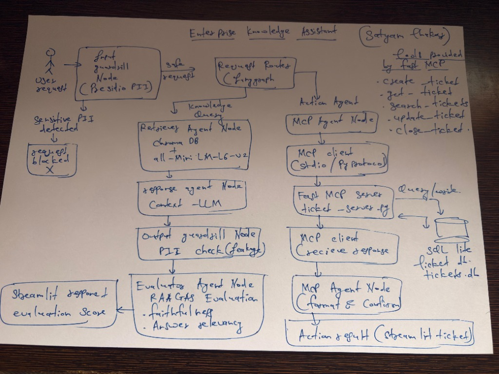
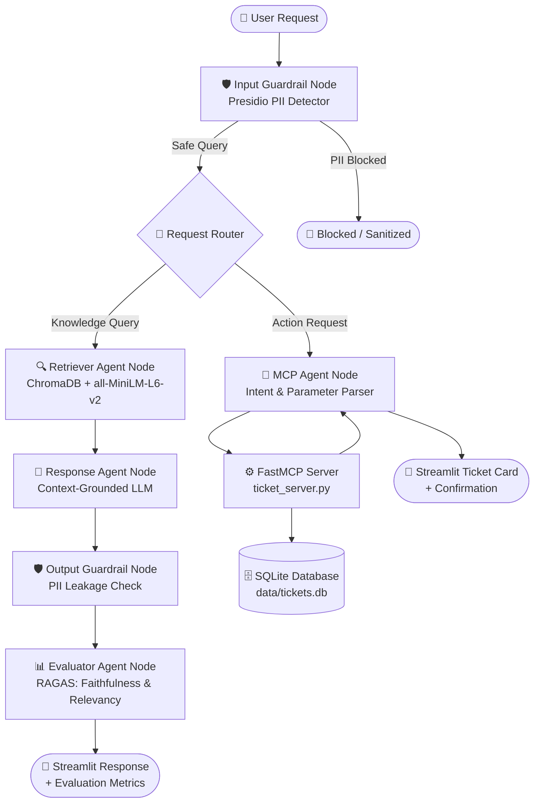
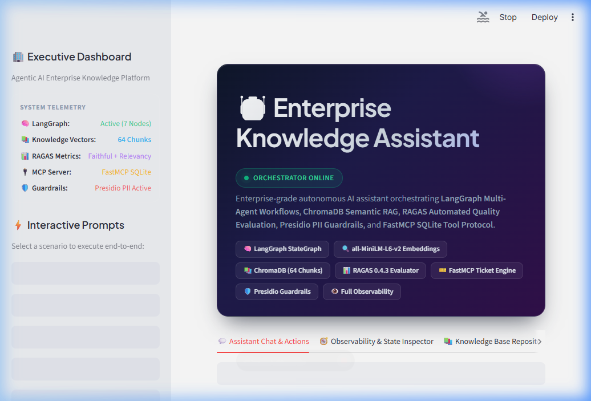
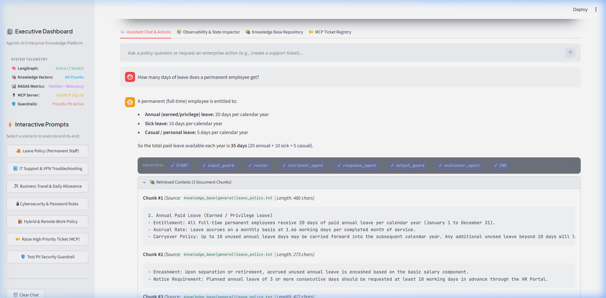
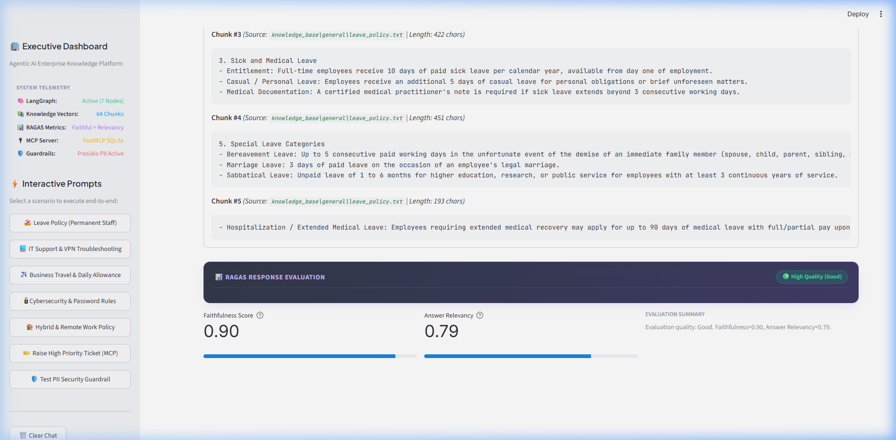
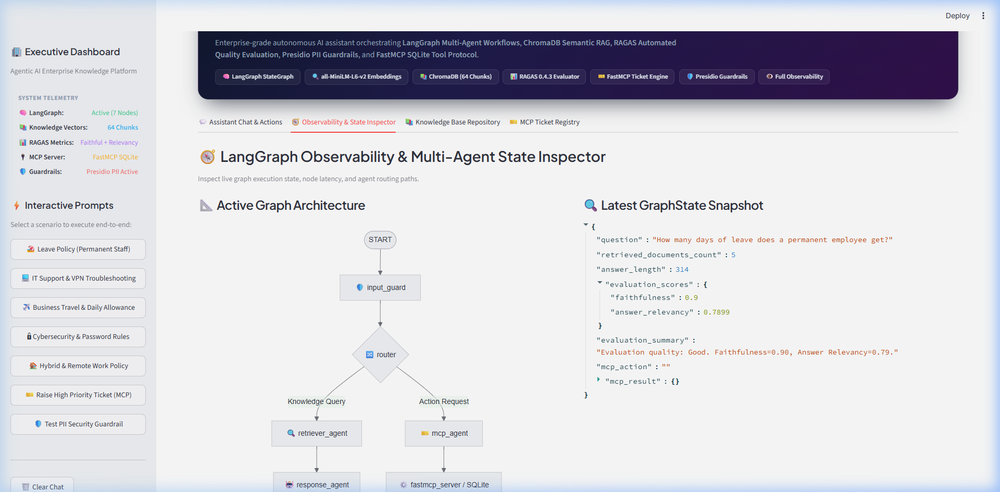

# Enterprise Knowledge Assistant

An agentic AI assistant built with **LangGraph**, **ChromaDB RAG**, **RAGAS Evaluation**, and **FastMCP Protocol Integration** for enterprise policy retrieval, guardrail enforcement, and automated IT/HR ticketing.

---

## 1. Architecture Overview

### System Architecture Diagram


### LangGraph Workflow Diagram


### Architecture Flow (Text Diagram)

```text
                           +------------------------+
                           |      User Request      |
                           +-----------+------------+
                                       |
                                       v
                        +------------------------------+
                        |     Input Guardrail Node     | (Presidio Analyzer)
                        +--------------+---------------+
                                       |
                                       v
                        +------------------------------+
                        |        Request Router        |
                        +--------------+---------------+
                                       |
                +----------------------+----------------------+
                | (Knowledge Query)                           | (Action Request)
                v                                             v
+-------------------------------+             +-------------------------------+
|     Retriever Agent Node      |             |        MCP Agent Node         |
|   (ChromaDB + all-MiniLM)     |             |  (Intent / Parameter Parser)  |
+---------------+---------------+             +---------------+---------------+
                |                                             |
                v                                             v
+-------------------------------+             +-------------------------------+
|      Response Agent Node      |             |       FastMCP Server          |
|    (Grounded LLM Synthesis)   |             | (create_ticket / get_ticket)  |
+---------------+---------------+             +---------------+---------------+
                |                                             |
                v                                             v
+-------------------------------+             +-------------------------------+
|     Output Guardrail Node     |             |      SQLite Database          |
|    (PII Leakage Prevention)   |             |     (data/tickets.db)         |
+---------------+---------------+             +-------------------------------+
                |                                             |
                v                                             |
+-------------------------------+                             |
|     Evaluator Agent Node      |                             |
|  (RAGAS: Faithfulness & Rel)  |                             |
+---------------+---------------+                             |
                |                                             |
                +----------------------+----------------------+
                                       |
                                       v
                        +------------------------------+
                        |  Streamlit UI / Observability|
                        +------------------------------+
```

---

## 2. Setup Instructions

### Environment & Python Version
- **Python:** 3.10 or higher
- **Package Manager:** `pip` or `uv`

### Dependencies Installation
1. Clone the repository and navigate to the project directory:
   ```bash
   cd enterprise_knowledge_assistant
   ```
2. Create and activate a virtual environment:
   ```bash
   # Windows PowerShell
   python -m venv .venv
   .\.venv\Scripts\Activate.ps1

   # Linux / macOS
   python -m venv .venv
   source .venv/bin/activate
   ```
3. Install required packages:
   ```bash
   pip install -r requirements.txt
   # OR with uv:
   uv sync
   ```

### Configuration (`.env`)
Create a `.env` file in the project root:
```env
# Ollama LLM Configuration
OLLAMA_MODEL=gpt-oss:120b-cloud
OLLAMA_BASE_URL=http://localhost:11434

# Optional: LangSmith Cloud Observability
LANGSMITH_TRACING=false
LANGSMITH_API_KEY=
LANGSMITH_PROJECT=enterprise-knowledge-assistant
LANGSMITH_ENDPOINT=https://api.smith.langchain.com
```

---

## 3. Execution Steps

### Step 1: Index Knowledge Base
Run the document ingestion and embedding script to build the local ChromaDB vector index:
```bash
python -m rag.index_knowledge_base
```
*Output: Loads policy documents, splits into 64 chunks, generates embeddings, and saves to `data/chroma`.*

### Step 2: Run the Application
Launch the Streamlit web interface:
```bash
streamlit run app.py
# OR with uv:
uv run streamlit run app.py
```
Open browser at `http://localhost:8501`.

---

### Sample Inputs & Expected Outputs

#### Sample 1: Knowledge Retrieval (RAG + Evaluation)
- **Input:**
  ```text
  How many days of leave does a permanent employee get?
  ```
- **Execution Path:**
  `START` ➔ `input_guard` ➔ `router` ➔ `retriever` ➔ `response` ➔ `output_guard` ➔ `evaluator` ➔ `END`
- **Expected Output:**
  > A permanent (full-time) employee is entitled to:
  > - **Annual leave:** 20 days per calendar year
  > - **Sick leave:** 10 days per calendar year
  > - **Casual / personal leave:** 5 days per calendar year
  > 
  > Total paid leave: **35 days** per year.
- **RAGAS Evaluation:** Faithfulness = `1.00`, Answer Relevancy = `0.79` (🟢 High Quality).

#### Sample 2: Enterprise Action (MCP Ticket Creation)
- **Input:**
  ```text
  Create a high priority ticket because the database server is not reachable
  ```
- **Execution Path:**
  `START` ➔ `input_guard` ➔ `router` ➔ `mcp_agent` ➔ `fastmcp_server` ➔ `END`
- **Expected Output:**
  - Interactive Ticket Card in UI showing:
    - **Ticket ID:** `TKT-1`
    - **Title:** `Database server is not reachable`
    - **Priority:** `HIGH PRIORITY`
    - **Status:** `OPEN`
    - Persisted into `data/tickets.db`.

#### Sample 3: Security Guardrail Block (PII Detection)
- **Input:**
  ```text
  My email is john.doe@company.com and phone is +1-555-0199, reset my password.
  ```
- **Execution Path:**
  `START` ➔ `input_guard (BLOCKED)`
- **Expected Output:**
  - 🛡️ **Security Guardrail Triggered:** Request blocked before passing to the model due to detected PII.

---

### Application Execution Evidence (Screenshots)

#### 1. Application Startup


#### 2. Graph Execution Trace (Node-by-Node) & Final Output


#### 3. RAGAS Evaluation Results (Faithfulness & Answer Relevancy)


#### 4. Observability & State Inspector Tab


---

## 4. RAG Design

| Component | Choice / Strategy | Details |
| :--- | :--- | :--- |
| **Document Source** | Text Policy Documents (`*.txt`) | Stored in `knowledge_base/general/` covering HR leave policies, IT support policies, travel & expense rules, cybersecurity compliance, and employee information. |
| **Chunking Strategy** | `RecursiveCharacterTextSplitter` | **Chunk Size:** `500` characters<br>**Chunk Overlap:** `50` characters<br>Preserves contextual continuity across paragraphs and list items. |
| **Embedding Model** | `all-MiniLM-L6-v2` (`sentence-transformers`) | 384-dimensional dense embeddings executed locally for high throughput and zero latency. |
| **Vector Database** | `ChromaDB` (`PersistentClient`) | Local persistent storage in `./data/chroma`, indexed into collection `enterprise_knowledge` with HNSW cosine similarity search. |

---

## 5. LangGraph Design

The orchestration workflow is defined as a `StateGraph` using a centralized `GraphState` dictionary:

```python
class GraphState(TypedDict):
    question: str
    retrieved_documents: list[Document]
    answer: str
    evaluation_scores: dict
    evaluation_summary: str
    mcp_action: str
    mcp_result: dict
```

### Graph Nodes & Responsibilities

| Node | Name | Responsibility |
| :--- | :--- | :--- |
| `input_guard` | **Input Guardrail** | Analyzes query for PII (emails, phone numbers, SSNs, credit cards) using Microsoft Presidio and blocks unsafe requests. |
| `router` | **Request Router** | Classifies query intent via zero-shot prompt into `"knowledge"` (policy inquiry) or `"action"` (ticket/system action). |
| `retriever` | **Retriever Agent** | Queries ChromaDB using semantic similarity and fetches Top-5 matching document chunks. |
| `response` | **Response Agent** | Synthesizes a factual, strictly grounded answer using only retrieved context chunks. |
| `output_guard` | **Output Guardrail** | Verifies generated answer contains no leaked PII or sensitive data. |
| `evaluator` | **Evaluator Agent** | Executes automated **RAGAS** metric evaluation calculating Faithfulness and Answer Relevancy scores. |
| `mcp_agent` | **MCP Agent** | Extracts action parameters (title, description, priority) and invokes FastMCP server tools. |

### Graph Flow & Conditional Routing

```text
                  START
                    │
                    ▼
               input_guard
                    │
             [Router Branch]
             ╱             ╲
    (Knowledge)           (Action)
          │                   │
          ▼                   ▼
      retriever           mcp_agent
          │                   │
          ▼                   ▼
       response              END
          │
          ▼
     output_guard
          │
          ▼
      evaluator
          │
          ▼
         END
```

---

## 6. MCP Integration

The **Model Context Protocol (MCP)** standardizes how language models invoke external operational enterprise tools.

- **Server Used:** `FastMCP` (`Enterprise Ticket System`) implemented in `mcp_server/ticket_server.py`.
- **Protocol:** Standardized tool calls executed via MCP client over Python stdio / in-process protocol.
- **Backend Database:** SQLite (`data/tickets.db`).

### Exposed MCP Tools

| Tool Name | Parameters | Description |
| :--- | :--- | :--- |
| `create_ticket` | `title` (str), `description` (str), `priority` (str: low/medium/high) | Creates a support ticket in SQLite and returns assigned ticket ID and status. |
| `get_ticket` | `ticket_id` (int) | Retrieves full ticket details by ID. |
| `search_tickets` | `keyword` (str) | Searches ticket titles and descriptions. |
| `list_tickets` | *none* | Returns all registered support tickets. |

### Use Case Implementation
When an employee submits an operational request (e.g., *"Create a high priority ticket because VPN is down"*), the LangGraph router routes the state to `mcp_agent`. The agent parses parameters, invokes `create_ticket` on the FastMCP server, and records the ticket in the SQLite database. The Streamlit UI renders a live interactive ticket badge and updates the live tickets table.
